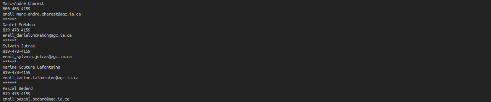
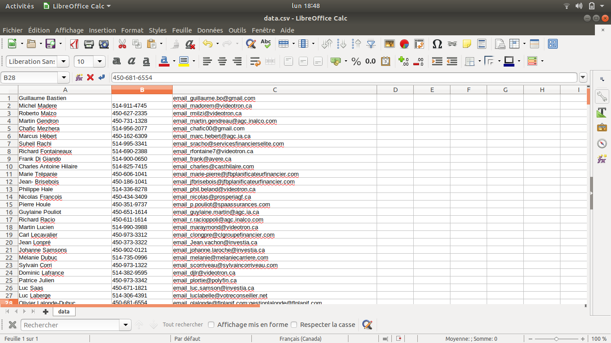

## Web Scraper
Une personne m'a demandé de l'aide pour extraire les informations sur un site (Nom, Téléphone, Adresse Mail). À la base je pensais utiliser l'extension Web Scraper IO sur chrome. Mais le site en question utilisait que des pages dynamiques pour afficher son contenu. Donc j'ai décidé d'utiliser Sélénium pour "émuler" un browser et ensuite BeautifulSoup pour parsing tous le HTML.
 
### Objectifs
* Naviguer sur le site en utilisant Sélénium.
* Insérer des caractères et être capable d'intéragir avec des Forms HTML.
* Scrap le Data avec BeautifulSoup.
* Output le Data en csv.

### Output au Terminal

### Output CSV

